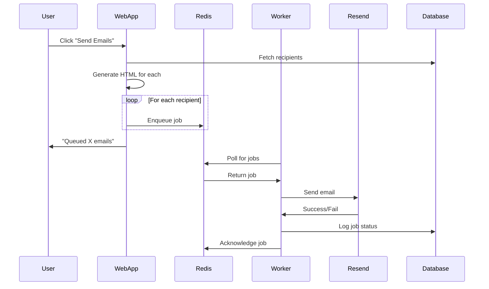

<!-- @format -->

# Email System Migration Summary

## What Changed

### Before (Nodemailer)

- Emails sent directly from web app
- Used SMTP (nodemailer)
- No retry mechanism
- No tracking or queue
- Single-threaded

### After (Resend + Queue)

- Emails enqueued to Redis
- Background worker processes queue
- Uses Resend API
- Job tracking in database
- Concurrent processing (5 at a time)
- Automatic retries

## Key Changes

### 1. Dependencies Added

- **Web App**: `bullmq`, `ioredis`
- **Worker**: `@power/db`, `bullmq`, `ioredis`, `resend`, `dotenv`

### 2. Files Modified

- [apps/web/src/actions/send-emails.ts](apps/web/src/actions/send-emails.ts) - Now enqueues jobs instead of sending directly
- [apps/worker/package.json](apps/worker/package.json) - Added @power/db dependency
- [apps/worker/index.ts](apps/worker/index.ts) - Imports worker
- [apps/web/.env](apps/web/.env) - Added REDIS_URL
- [apps/worker/.env](apps/worker/.env) - Added REDIS_URL and DATABASE_URL

### 3. Files Created

- [apps/worker/README.md](apps/worker/README.md) - Worker documentation
- [apps/worker/.env.example](apps/worker/.env.example) - Environment template
- [apps/worker/test-queue.ts](apps/worker/test-queue.ts) - Queue test script
- [EMAIL_QUEUE_SETUP.md](EMAIL_QUEUE_SETUP.md) - Comprehensive setup guide

### 4. Email Templates

- Moved from nodemailer to inline HTML in `send-emails.ts`
- `generateIncompleteTeamEmailHTML()` function created
- Same email design, different delivery method

## How It Works Now



## Benefits

1. **Reliability**: Jobs are persisted in Redis, won't be lost
2. **Scalability**: Can add more workers to handle load
3. **Monitoring**: Track every email in the database
4. **Performance**: Non-blocking, web app responds immediately
5. **Rate Limiting**: Worker controls send rate (5 concurrent)
6. **Better Provider**: Resend has better deliverability than SMTP

## Environment Variables

### Web App

```env
REDIS_URL=redis://localhost:6379
DATABASE_URL=postgresql://...
```

### Worker

```env
RESEND_API_KEY=re_xxxxx
EMAIL_FROM="No Reply <noreply@domain.com>"
REDIS_URL=redis://localhost:6379
DATABASE_URL=postgresql://...
```

## Running the System

### Development

```bash
# Terminal 1: Redis
docker run -d -p 6379:6379 redis:alpine

# Terminal 2: Worker
cd apps/worker && bun start

# Terminal 3: Web App
cd apps/web && bun dev
```

### Production

- Deploy web app as usual (Vercel/Railway)
- Deploy worker as separate service
- Use managed Redis (Upstash/Redis Cloud)
- Set environment variables in both services

## Testing

1. **Test Queue Connection**:

   ```bash
   cd apps/worker && bun run test-queue.ts
   ```

2. **Send Test Email**:
   - Navigate to `/admin/email`
   - Add your test email
   - Select "Incomplete Team" template
   - Click Send

3. **Monitor**:
   - Check worker logs for "✅ Sent to..."
   - Check database: `SELECT * FROM email_job;`
   - Check Resend dashboard

## Rollback Plan

If issues arise, you can temporarily revert by:

1. Re-importing nodemailer in `send-emails.ts`
2. Replacing queue calls with direct `sendMail()` calls
3. The old `sendAlertEmail()` function is still in `apps/web/src/email/scripts/alert.ts`

## Next Steps

- [ ] Add more email templates (welcome, reminder, etc.)
- [ ] Add email preview in UI
- [ ] Add campaign analytics dashboard
- [ ] Set up monitoring/alerting for failed jobs
- [ ] Configure job retention policies
- [ ] Add scheduled emails (cron jobs)
